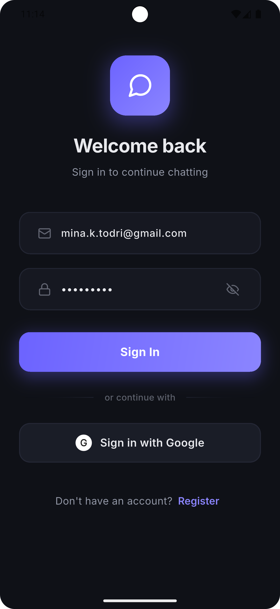
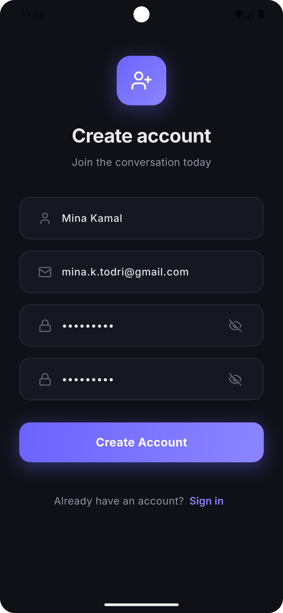
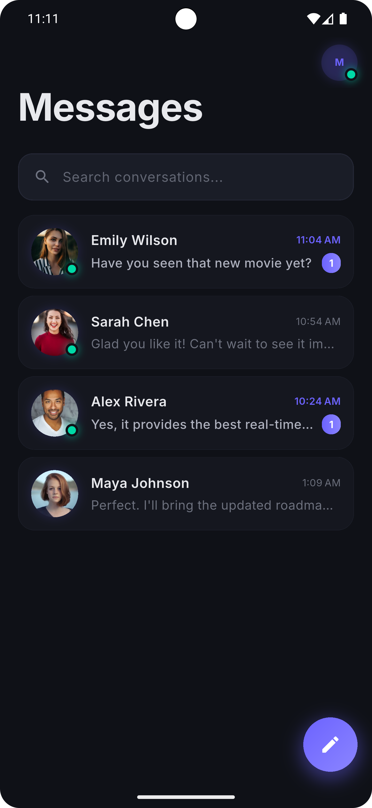
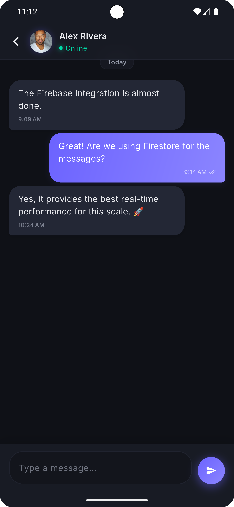
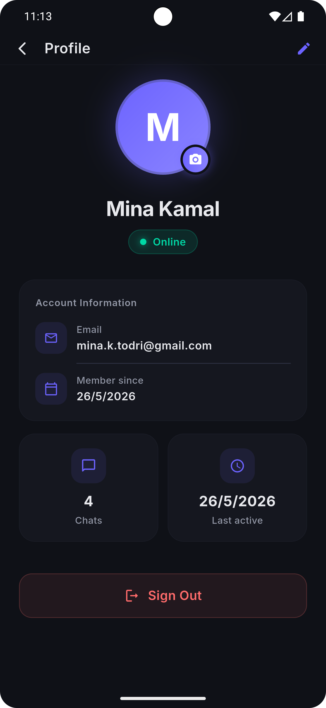

# Chat App 💬

A real-time Flutter chat application built with Firebase, featuring live messaging, typing indicators, and a clean dark UI.

---

## 📷 Screenshots

| Login Screen | Register Screen |
|:---:|:---:|
|  |  |

| Home Screen | Users Screen |
|:---:|:---:|
|  |  |

| Chat Screen | Profile Screen |
|:---:|:---:|
|  |  |

| Other User Profile |
|:---:|
|  |
---

## ✨ Features

- Real-time messaging with Cloud Firestore
- Typing indicators
- Unread message count
- User authentication (login & register)
- View other users' profiles
- Clean dark UI

---

## 🛠️ Tech Stack

- Flutter & Dart
- Firebase Authentication
- Cloud Firestore
- Google Fonts

---

## 🚀 Getting Started

### Prerequisites

- Flutter SDK
- Android Studio or VS Code
- Emulator or physical device
- Firebase project (free at [firebase.google.com](https://firebase.google.com))

### Installation

1. Clone the repository
```bash
git clone https://github.com/mina-todri/chat_app.git
cd chat_app
```

2. Add your Firebase configuration

Create `lib/firebase_options.dart` using the FlutterFire CLI:
```bash
flutterfire configure
```

> ⚠️ `firebase_options.dart` is not included for security reasons. You must connect your own Firebase project.

3. Install dependencies
```bash
flutter pub get
```

4. Run the app
```bash
flutter run
```

---

## 📂 Project Structure

```
lib/
├── main.dart
├── auth_service.dart
├── models/
│   ├── message_model.dart
│   └── conversation_model.dart
├── screens/
│   ├── chat_screen.dart
│   ├── home_screen.dart
│   ├── login_screen.dart
│   ├── register_screen.dart
│   ├── users_screen.dart
│   ├── profile_screen.dart
│   └── other_profile_screen.dart
├── services/
│   └── chat_service.dart
├── themes/
│   └── AppColors.dart
└── core/
    └── auth_errors.dart
```

---

## 👨‍💻 Author

**Mina Kamal** — Flutter Developer

[](https://github.com/mina-todri)
[](https://www.linkedin.com/in/mina-kamal-b56560313)